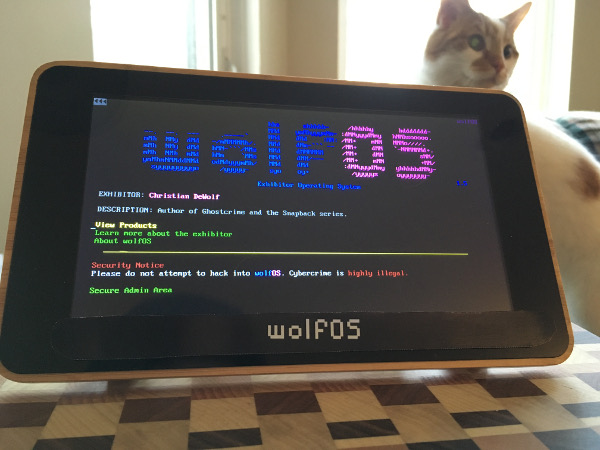
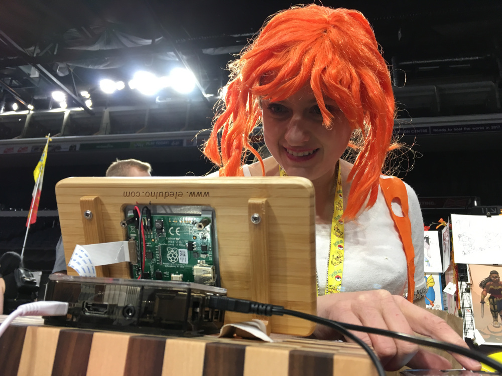
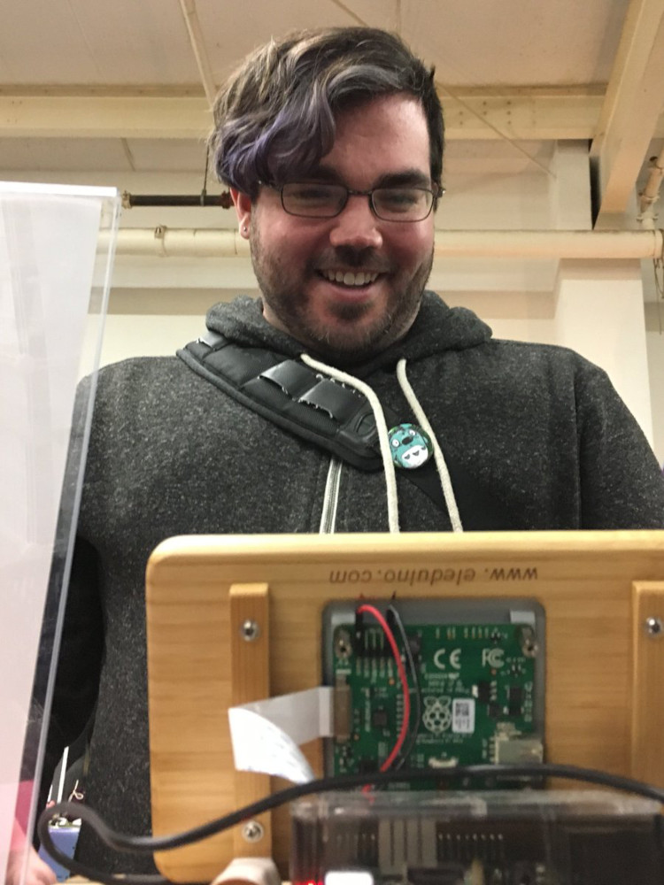

# wolfOS: Exhibitor Operating System

Originally made for Hal-Con 2017, this version was updated for Spring Geequinox 2018.

Install on a Raspberry Pi for the classic convention experience, or emulate on a modern Mac using the Terminal.

## Installation

Clone the repo:
`git clone https://github.com/mirthturtle/wolfOS-legacy.git`

### MacOS
- Install [Homebrew](https://brew.sh/)
- Install Lynx browser: `brew install lynx`

### Raspberry Pi
- Install Lynx browser: `sudo apt-get install lynx`

## Running wolfOS
- Navigate to the `wolfos-legacy` directory
- Run `lynx /index.html`

## Improve the Lynx UI for better user experience at exhibitions

Modify the Raspberry Pi's font size to fit your screen size:
`sudo dpkg-reconfigure console-setup`
and follow the instructions.

To shrink the Lynx footer nav bar from 3 lines to 1:
- Press `o` for options
- Set the User Mode to `Advanced` and Accept Changes.

To remove the final line of the Lynx footer bar:
- Cover with a piece of tape or small sign

-------------------------------------------

With contributions from [Michelle Proulx](https://michelleproulx.com/), [Bruce Delo](https://flyknifecomics.com) & [Dawn Davis](http://www.playerprophet.com).
